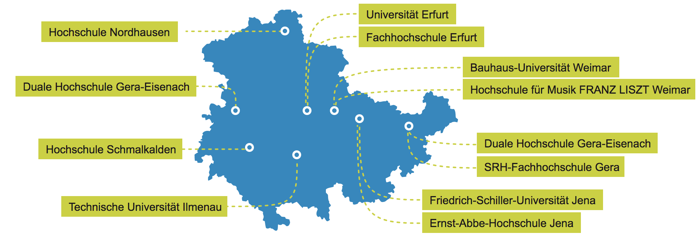

# Überblick Informatikstudiengänge Thüringen

Übersicht Hochschulen in Thüringen: https://www.campus-thueringen.de/hochschulen-in-thueringen/

Virtuelle Campus-Touren: https://www.campus-thueringen.de/hochschulen-in-thueringen/360-campustouren/

---

## Fachhochschule Erfurt (https://www.fh-erfurt.de)

Studierende: 4.237

grundständige Studiengänge: 18

weiterführende Studiengänge: 16

##### Angewandte Informatik (https://www.ai.fh-erfurt.de/start/)

* Bachelor of Science Angewandte Informatik (https://www.fh-erfurt.de/fhe/studieninteressierte/bachelor-studium/angewandte-informatik-bachelor/)
* Master of Science Angewandte Informatik (https://www.fh-erfurt.de/fhe/?id=3358)

---

## Bauhaus-Universität Weimar (https://www.uni-weimar.de)

Studierende: 4.083

grundständige Studiengänge: 12

weiterführende Studiengänge: 20

##### Medieninformatik (https://www.uni-weimar.de/de/kontrast/medien/struktur/fachbereich-medieninformatik/)

* Medieninformatik (B.Sc.) (https://www.uni-weimar.de/de/kontrast/medien/studium-alt/medieninformatik-computer-science-for-digital-media-hci/medieninformatik-bsc/)

* Computer Science for Digital Media (M.Sc.) (https://www.uni-weimar.de/de/kontrast/medien/studium-alt/medieninformatik-computer-science-for-digital-media-hci/computer-science-for-digital-media-msc/)

* Human-Computer Interaction (M.Sc.) (https://www.uni-weimar.de/de/kontrast/medien/studium-alt/medieninformatik-computer-science-for-digital-media-hci/human-computer-interaction-msc/)

* Digital Engineering (M.Sc.) (https://www.uni-weimar.de/de/kontrast/bauingenieurwesen/studium/masterstudiengaenge/digital-engineering/)

---

## Technische Universität Ilmenau (https://www.tu-ilmenau.de/studieninteressierte/)

Studierende: 6.619

grundständige Studiengänge: 20

weiterführende Studiengänge: 25

##### Elektrotechnik und Informationstechnik (http://www5.tu-ilmenau.de/eit/)

* Elektrotechnik und Informationstechnik (B.Sc.) (https://www.tu-ilmenau.de/studieninteressierte/studienangebot/bachelor/elektrotechnik-und-informationstechnik-bsc/)
* Elektrotechnik und Informationstechnik (M.Sc.) (https://www.tu-ilmenau.de/studieninteressierte/studienangebot/master/elektrotechnik-und-informationstechnik-msc/)
* Elektrotechnik und Informationstechnik (Dipl.-Ing.) (https://www.tu-ilmenau.de/studieninteressierte/studienangebot/diplom/elektrotechnik-und-informationstechnik-dipl-ing/)

##### Informatik

* Informatik (B.Sc.) (https://www.tu-ilmenau.de/studieninteressierte/studienangebot/bachelor/informatik-bsc/)
* Informatik (M.Sc.) (https://www.tu-ilmenau.de/studieninteressierte/studienangebot/master/informatik-msc/)

##### Ingenieurinformatik

* Ingenieurinformatik (B.Sc.) (https://www.tu-ilmenau.de/studieninteressierte/studienangebot/bachelor/ingenieurinformatik-bsc/)
* Ingenieurinformatik (M.Sc.) (https://www.tu-ilmenau.de/studieninteressierte/studienangebot/master/ingenieurinformatik-msc/)

##### Medientechnologie

* Medientechnologie (B.Sc.) (https://www.tu-ilmenau.de/studieninteressierte/studienangebot/bachelor/medientechnologie-bsc/)
* Medientechnologie (M.Sc.) (https://www.tu-ilmenau.de/studieninteressierte/studienangebot/master/medientechnologie-msc/)

##### Wirtschaftsinformatik

* Wirtschaftsinformatik (B.Sc.) (https://www.tu-ilmenau.de/studieninteressierte/studienangebot/bachelor/wirtschaftsinformatik-bsc/)
* Wirtschaftsinformatik (M.Sc.) (https://www.tu-ilmenau.de/studieninteressierte/studienangebot/master/wirtschaftsinformatik-msc/)

##### Weitere Informatik- oder Informatiknahe Studiengänge

* Research in Computer & Systems Engineering (M.Sc.) (https://www.tu-ilmenau.de/studieninteressierte/studienangebot/master/research-in-computer-systems-engineering-msc/)

---

## Friedrich-Schiller-Universität Jena (http://www.uni-jena.de/)

Studierende: 17.794

grundständige Studiengänge: 102

weiterführende Studiengänge: 73

##### Angewandte Informatik

* Angewandte Informatik (Bachelor of Science) (http://www.uni-jena.de/Studium/Studienangebot/BSc_Angewandte+Informatik.html)

##### Informatik

* Informatik (B.Sc.) (http://www.uni-jena.de/Studium/Studienangebot/BSc_Informatik.html)
* Informatik (M.Sc.) (http://www.uni-jena.de/Studium/Studienangebot/MSc_Informatik.html)
* Informatik (Erste Staatsprüfung für das Lehramt an Gymnasien) (http://www.uni-jena.de/Studium/Studienangebot/LG_Informatik.html)
* Informatik (Erste Staatsprüfung für das Lehramt an Regelschulen) (http://www.uni-jena.de/Studium/Studienangebot/LR_Informatik.html)

##### Bioinformatik

* Bioinformatik (B.Sc.) (http://www.uni-jena.de/Studium/Studienangebot/BSc_Bioinformatik.html)
* Bioinformatik (M.Sc.) (http://www.uni-jena.de/Studium/Studienangebot/MSc_Bioinformatik.html)

##### Weitere Informatik- oder Informatiknahe Studiengänge

* Computational and Data Science (M.Sc.) (http://www.uni-jena.de/Studium/Studienangebot/MSc_Computational_and_Data_Science.html)
* Informatik (M.Sc.) (http://www.uni-jena.de/Studium/Studienangebot/MSc_Informatik.html)
* Wirtschaftsinformatik (M.Sc.) (http://www.uni-jena.de/Studium/Studienangebot/MSc_Wirtschaftsinformatik.html)
* Geoinformatik (M.Sc.) (http://www.uni-jena.de/Studium/Studienangebot/MSc_Geoinformatik.html)

---

## Ernst-Abbe-Hochschule Jena (http://www.eah-jena.de/)

Studierende: 4.533

grundständige Studiengänge: 24

weiterführende Studiengänge: 21

##### Automatisierungs​​​​​​technik / Informationstechnik

* Automatisierungs​​​​​​technik / Informationstechnik International (B.Sc.) (https://www.eah-jena.de/de-de/studium/studienangebote/Bachelor-Automatisierungstechnik-Informationstechnik-international)

##### Business Information Systems

* Business Information Systems (B.Sc.) (https://www.eah-jena.de/de-de/studium/studienangebote/Bachelor-Business-Information-Systems)

##### E-Commerce

* E-Commerce (B.Sc.) (https://www.eah-jena.de/de-de/studium/studienangebote/Bachelor-E-Commerce)

##### Elektrotechnik/Informationstechnik

* Elektrotechnik / Informationstechnik (B.Eng.) (https://www.eah-jena.de/de-de/studium/studienangebote/bachelor-elektrotechnik-informationstechnik)
* Elektrotechnik/Informationstechnik Frauenstudiengang (B.Sc.) (https://www.eah-jena.de/de-de/studium/studienangebote/bachelor-elektrotechnik-informationstechnik-frauen)

##### Wirtschaftsingenieurwesen (Informationstechnik) 

* Wirtschaftsingenieurwesen (Informationstechnik) (B.Sc.) (https://www.eah-jena.de/de-de/studium/studienangebote/Bachelor-Wirtschaftsingenieurwesen-Informationstechnik)

---

## Hochschule Nordhausen (https://www.hs-nordhausen.de)

Studierende: 2.340

grundständige Studiengänge: 15

weiterführende Studiengänge: 8

##### Informatik

* Informatik (B.Sc.) (https://www.hs-nordhausen.de/studium/fb-ing/informatik/)
* Internet - Technologie und Anwendungen (B.Eng.) (https://www.hs-nordhausen.de/studium/fb-ing/ita/)

##### Weitere Informatik- oder Informatiknahe Studiengänge

* Systems Engineering (M.Eng.) (interessant bei Ausrichtung "Technische Automatisierungssysteme" und "Mobile Informationssysteme") (https://www.hs-nordhausen.de/studium/fb-ing/systems-engineering/)

---

## Hochschule Schmalkalden (https://www.hs-schmalkalden.de/)

Studierende: 2.816

grundständige Studiengänge: 20

weiterführende Studiengänge: 14

##### Bachelor 

* Informatik (B. Sc.) (https://www.hs-schmalkalden.de/studium/studienangebot-hs-schmalkalden/bachelor-studiengaenge/informatik-bsc.html)
* Mobile Computing (B.Sc.) (https://www.hs-schmalkalden.de/studium/studienangebot-hs-schmalkalden/bachelor-studiengaenge/mobile-computing-bsc.html)
* Wirtschaftsinformatik (B.Sc.) (https://www.hs-schmalkalden.de/studium/studienangebot-hs-schmalkalden/bachelor-studiengaenge/wirtschaftsinformatik-bsc.html)

##### Master

* Angewandte Medieninformatik (M.Sc.) (https://www.hs-schmalkalden.de/studium/studienangebot-hs-schmalkalden/master-studiengaenge/angewandte-medieninformatik-msc.html)
* Applied Computer Science (M.Sc.) (https://www.hs-schmalkalden.de/studium/studienangebot-hs-schmalkalden/master-studiengaenge/applied-computer-science-msc.html)

---

Zusätzlich gibt es die Duale Hochschule:

## Duale Hochschule Gera-Eisenach (https://www.dhge.de/DHGE.html)

* Informations- und Kommunikationstechnologien (B.Sc.) (https://www.dhge.de/DHGE/Studiengaenge/Technik/Informations_und_Kommunikationstechnologien_Gera.html)
* Praktische Informatik (B.Sc.) (https://www.dhge.de/DHGE/Studiengaenge/Technik/Praktische_Informatik.html)
* Wirtschaftsinformatik (B.Sc.) (https://www.dhge.de/DHGE/Studiengaenge/Technik/Wirtschaftsinformatik.html)

